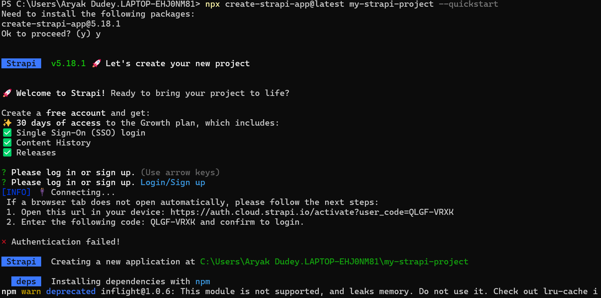
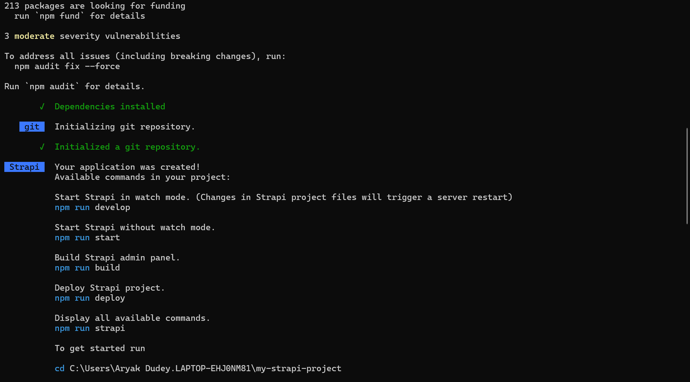
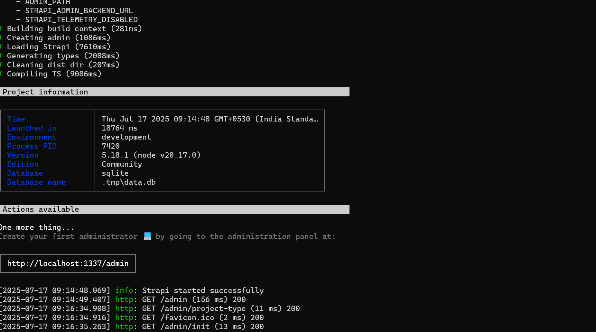
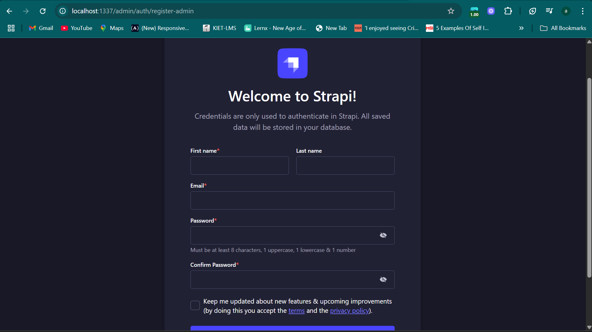

📄 Strapi Installation & Admin Setup – DAY1

✅ Step 1: Create Strapi App

🔄 Step 2: Dependencies Installation

⚙️ Step 3: Building the Admin Panel

👤 Step 4: Register Admin User

🧪 Result:
Strapi project was successfully created.

Admin Panel is working at http://localhost:1337/admin.

We can now create collections, manage APIs, and interact with content using a simple UI.